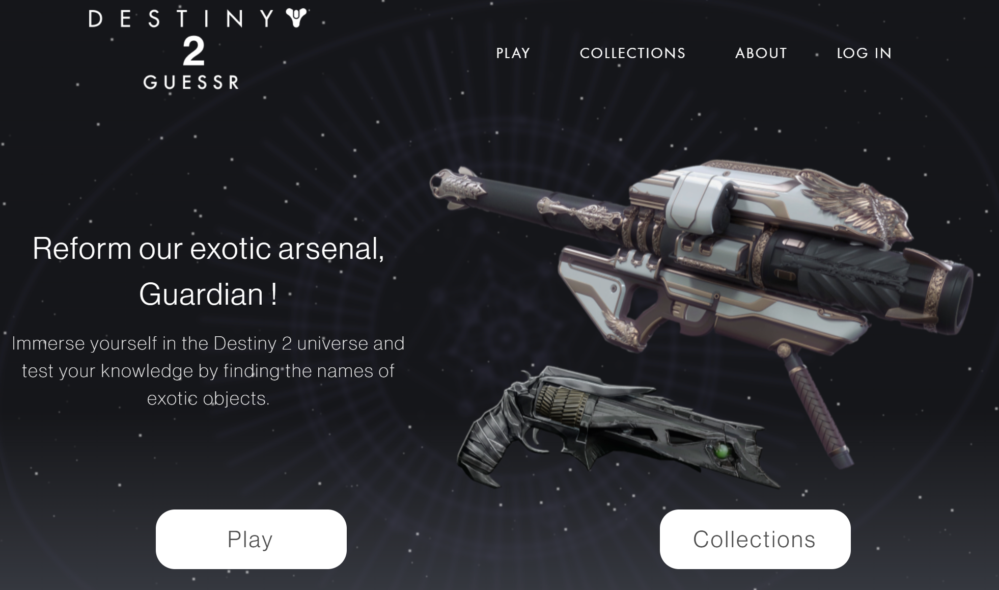

 

Destiny 2 Guessr web application with games and quizz about Destiny 2 developed with Django 5.2 and Angular CLI 20.

### 🏡 Setup for local deployment

  
1. Install [Python env](https://www.python.org/downloads/), [Postgres](https://www.postgresql.org) and [Node.js](https://nodejs.org/en).

2. Clone git repository :
`git clone https://github.com/Yoannmont/Destiny-2-guessr.git`

3. Start **Database** :
Create a Postgres Database and put connection credientials in server/settings.py

4. Start **Server**:
In terminal :
- Ensure you're in server folder (or run `cd app`) 
- Install libraries by running `pip install -r requirements.lock`
- Build app by running `python manage.py runserver [address]:[port]`

### 🐳 Setup for Docker deployment

1. Install [Docker Desktop](https://www.docker.com/products/docker-desktop/) (and create an account).

2. Clone git repository :
`git clone https://github.com/Yoannmont/Destiny-2-guessr.git`

3. Build client and server apps in containers by running
`docker compose up` (Default ports : Web app 4200, Server 8000).
⚠️ Note: The build process may take up to 5 minutes as it fetches the latest data directly from the Bungie database.

## Developed with 

- **Django**: Python backend for API.
- **PostgreSQL** : Database management system.
- **Angular CLI 20.1**: Front-end framework for user interface development.
- **Docker**: Application containerization.
